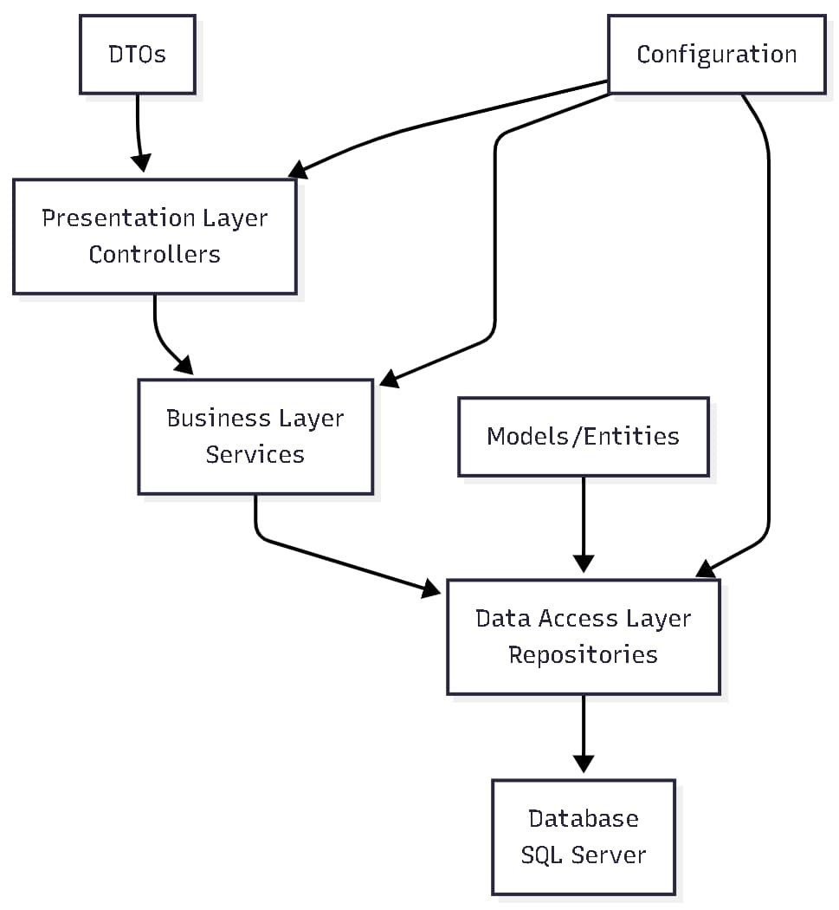
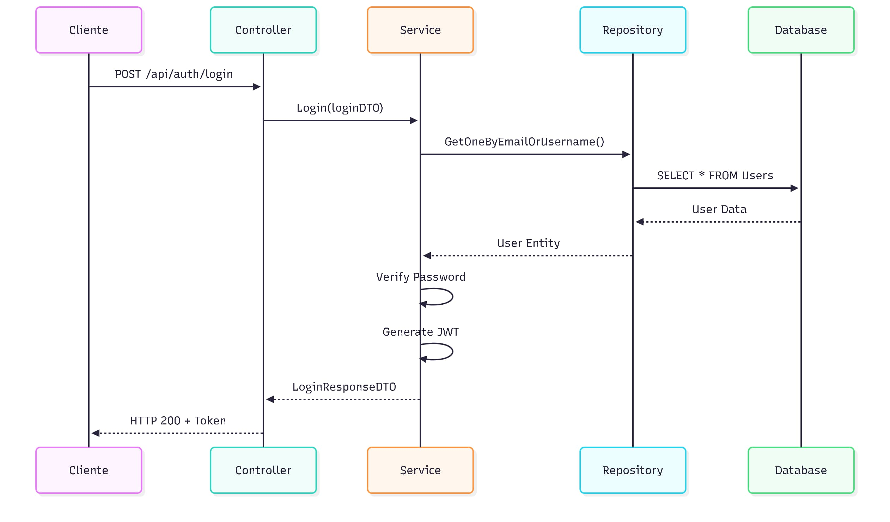

# Arquitectura de ASP.NET Core

## Introducción a la Arquitectura

La arquitectura de ASP.NET Core está diseñada siguiendo principios de **Clean Architecture** y **Domain-Driven Design (DDD)**, proporcionando una estructura modular, mantenible y escalable. Las aplicaciones ASP.NET Core típicamente implementan una arquitectura en capas (Onion Architecture) que separa claramente las responsabilidades.

## Patrones de Arquitectura Implementados

### 🏗️ **Arquitectura en Capas (Layered Architecture)**



#### **Capa de Presentación (Controllers)**

- **Responsabilidad**: Manejo de requests HTTP y respuestas
- **Componentes**: Controladores de API
- **Características**:
  - Validación de entrada
  - Manejo de errores HTTP
  - Serialización de respuestas
  - Documentación con Swagger

#### **Capa de Negocio (Services)**

- **Responsabilidad**: Lógica de negocio y orquestación
- **Componentes**: Servicios de dominio
- **Características**:
  - Validación de reglas de negocio
  - Transformación de datos
  - Coordinación entre repositorios
  - Procesamiento de lógica de negocio

#### **Capa de Acceso a Datos (Repositories)**

- **Responsabilidad**: Abstracción del acceso a datos
- **Componentes**: Repositorios de entidades
- **Características**:
  - Operaciones CRUD
  - Consultas complejas
  - Mapeo de entidades
  - Abstracción de la base de datos

### 🔄 **Patrón Repository**

El patrón Repository proporciona una abstracción sobre la capa de acceso a datos, permitiendo que la lógica de negocio sea independiente de la implementación específica de la base de datos.

```csharp
// Interfaz del repositorio
public interface IUserRepository : IRepository<User>
{
    // Métodos específicos del usuario
}

// Implementación del repositorio
public class UserRepository : Repository<User>, IUserRepository
{
    public UserRepository(ApplicationDbContext db) : base(db) { }

    public async Task<User> GetOneByEmailOrUsername(string email, string username)
    {
        return await dbSet
            .Include(x => x.Roles)
            .FirstOrDefaultAsync(x => x.Email == email || x.UserName == username);
    }
}
```

### 🎯 **Patrón DTO (Data Transfer Object)**

Los DTOs encapsulan datos que se transfieren entre capas, proporcionando una interfaz limpia y desacoplada.

```csharp
// DTO para registro
public class RegisterDTO
{
    [Required]
    [MinLength(2)]
    public string UserName { get; set; } = null!;

    [Required]
    [EmailAddress]
    public string Email { get; set; } = null!;

    [Required]
    [MinLength(8)]
    public string Password { get; set; } = null!;
}

// DTO para respuesta de login
public class LoginResponseDTO
{
    public string Token { get; set; } = null!;
    public UserWithoutPassDTO User { get; set; } = null!;
}
```

### 🏭 **Patrón Service Layer**

Los servicios encapsulan la lógica de negocio y coordinan las operaciones entre diferentes componentes.

```csharp
public class AuthServices
{
    private readonly UserServices _userServices;
    private readonly IEncoderServices _encoderServices;
    private readonly IMapper _mapper;

    public async Task<LoginResponseDTO> Login(LoginDTO login, HttpContext context)
    {
        // 1. Validar credenciales
        var user = await _userServices.GetOneByEmailOrUsername(login.EmailOrUsername);

        // 2. Verificar contraseña
        bool isValid = _encoderServices.Verify(login.Password, user.Password);

        // 3. Generar token JWT
        string token = GenerateJwt(user);

        // 4. Crear cookie de sesión
        await SetCookie(user, context);

        return new LoginResponseDTO { Token = token, User = user };
    }
}
```

## Estructura de Directorios

### 📁 **Organización del Proyecto**

```
Auth/
├── Controllers/              # Capa de Presentación
│   └── AuthController.cs
├── Models/                   # Entidades y DTOs
│   ├── User/
│   │   ├── User.cs          # Entidad principal
│   │   └── Dto/             # DTOs específicos
│   └── Role/
│       └── Role.cs
├── Services/                 # Capa de Negocio
│   ├── AuthServices.cs
│   ├── UserServices.cs
│   └── EncoderServices.cs
├── Repositories/             # Capa de Acceso a Datos
│   ├── Repository.cs        # Repositorio base
│   ├── UserRepository.cs
│   └── RoleRepository.cs
├── Config/                   # Configuración
│   ├── ApplicationDbContext.cs
│   └── Mapping.cs           # AutoMapper
├── Utils/                    # Utilidades
│   ├── HttpMessage.cs
│   └── AuthOperationFilter.cs
└── Migrations/              # Migraciones EF
```

### 🎨 **Principios de Diseño Aplicados**

#### **1. Single Responsibility Principle (SRP)**

Cada clase tiene una única responsabilidad:

- `AuthController` → Manejo de requests HTTP
- `AuthServices` → Lógica de autenticación
- `UserRepository` → Acceso a datos de usuarios

#### **2. Open/Closed Principle (OCP)**

El sistema es abierto para extensión pero cerrado para modificación:

- Interfaces de repositorios permiten diferentes implementaciones
- Servicios pueden ser extendidos sin modificar código existente

#### **3. Dependency Inversion Principle (DIP)**

Dependencias se inyectan desde abstracciones:

```csharp
// En lugar de crear instancias directamente
public AuthController(AuthServices authServices)
{
    _authServices = authServices; // Inyectado por DI
}
```

#### **4. Interface Segregation Principle (ISP)**

Interfaces específicas y cohesivas:

```csharp
public interface IUserRepository : IRepository<User>
{
    // Solo métodos específicos de usuario
}
```

## Flujo de Datos en la Arquitectura

### 🔄 **Flujo de Request Completo**



### 🛡️ **Middleware Pipeline**


## Configuración de Dependencias

### 🔧 **Inyección de Dependencias**

```csharp
// En Program.cs
builder.Services.AddScoped<UserServices>();
builder.Services.AddScoped<AuthServices>();
builder.Services.AddScoped<IEncoderServices, EncoderServices>();
builder.Services.AddScoped<IUserRepository, UserRepository>();
builder.Services.AddScoped<IRoleRepository, RoleRepository>();
```

#### **Tipos de Inyección**

- **Scoped**: Una instancia por request HTTP
- **Singleton**: Una instancia para toda la aplicación
- **Transient**: Nueva instancia cada vez que se solicita

### 🗄️ **Configuración de Base de Datos**

```csharp
builder.Services.AddDbContext<ApplicationDbContext>(opts =>
{
    opts.UseSqlServer(builder.Configuration.GetConnectionString("authConnection"));
});
```

## Ventajas de esta Arquitectura

### ✅ **Beneficios**

1. **Mantenibilidad**: Código organizado y fácil de mantener
2. **Testabilidad**: Componentes desacoplados y fáciles de testear
3. **Escalabilidad**: Fácil agregar nuevas funcionalidades
4. **Reutilización**: Componentes reutilizables en diferentes contextos
5. **Flexibilidad**: Fácil cambiar implementaciones sin afectar otras capas

### 🎯 **Casos de Uso Ideales**

- Aplicaciones empresariales complejas
- APIs REST con múltiples endpoints
- Sistemas que requieren alta mantenibilidad
- Proyectos con equipos de desarrollo grandes
- Aplicaciones que necesitan testing exhaustivo

## Mejores Prácticas

### 📋 **Recomendaciones**

1. **Separación de Responsabilidades**: Cada capa tiene un propósito específico
2. **Inyección de Dependencias**: Usar interfaces para desacoplar componentes
3. **Manejo de Errores**: Implementar manejo consistente de excepciones
4. **Logging**: Registrar eventos importantes en cada capa
5. **Validación**: Validar datos en múltiples capas
6. **Documentación**: Mantener documentación actualizada

### ⚠️ **Consideraciones**

- **Complejidad**: La arquitectura puede ser excesiva para proyectos simples
- **Overhead**: Múltiples capas pueden introducir latencia
- **Curva de Aprendizaje**: Requiere conocimiento de patrones de diseño
- **Configuración**: Más configuración inicial comparado con enfoques simples
