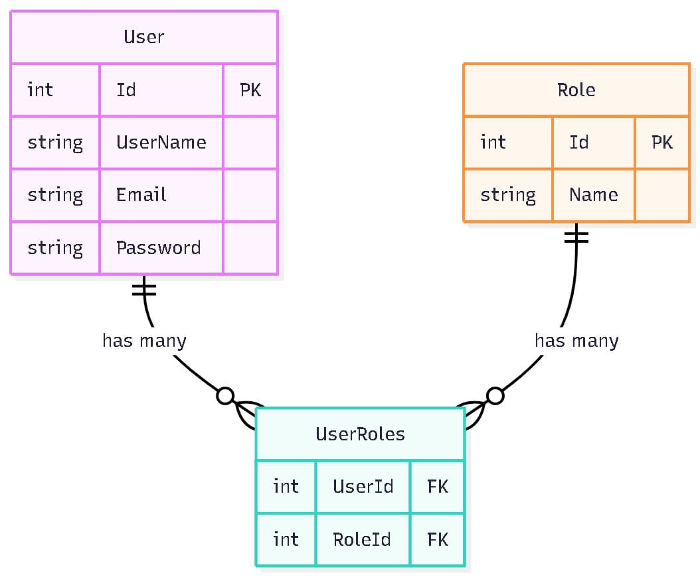

# Modelos y DTOs en ASP.NET Core

## Introducción a Modelos y DTOs

Los **Modelos** y **DTOs (Data Transfer Objects)** son componentes fundamentales en la arquitectura de ASP.NET Core que definen la estructura de datos y facilitan la transferencia de información entre diferentes capas de la aplicación. Las aplicaciones ASP.NET Core implementan sistemas robustos de modelos y DTOs que garantizan la integridad y seguridad de los datos.

## Conceptos Fundamentales

### 🏗️ **Modelos (Entities)**

Los modelos representan las entidades del dominio de negocio y se mapean directamente a las tablas de la base de datos. Son la representación de los datos en su forma más pura.

### 📦 **DTOs (Data Transfer Objects)**

Los DTOs son objetos diseñados específicamente para transferir datos entre capas de la aplicación, especialmente entre el cliente y el servidor. Proporcionan una interfaz limpia y segura para el intercambio de información.

## Estructura de Modelos

### 👤 **Modelo de Entidad (Ejemplo)**

```csharp
public class Product
{
    [Key]
    [DatabaseGenerated(DatabaseGeneratedOption.Identity)]
    public int Id { get; set; }

    public string Name { get; set; } = null!;

    public string Description { get; set; } = null!;

    public decimal Price { get; set; }

    public List<Category> Categories { get; set; } = new();
}
```

#### **Características del Modelo:**

- **Id**: Clave primaria auto-incremental
- **Name**: Nombre del producto
- **Description**: Descripción del producto
- **Price**: Precio del producto
- **Categories**: Relación many-to-many con categorías

#### **Anotaciones de Validación:**

- `[Key]`: Define la clave primaria
- `[DatabaseGenerated]`: Configuración de generación automática
- `null!`: Operador de supresión de null para C# nullable

### 🛡️ **Modelo Role (Sistema de Roles)**

```csharp
public class Role
{
    [Key]
    [DatabaseGenerated(DatabaseGeneratedOption.Identity)]
    public int Id { get; set; }

    public string Name { get; set; } = null!;
}

public class UserRoles
{
    public int UserId { get; set; }
    public int RoleId { get; set; }
}
```

#### **Características del Sistema de Roles:**

- **Role**: Entidad que define los roles del sistema
- **UserRoles**: Tabla de unión para relación many-to-many
- **Roles Predefinidos**: USER, ADMIN, MOD

### 📋 **Enumeraciones y Constantes**

```csharp
public static class ROLE
{
    public const string USER = "User";
    public const string ADMIN = "Admin";
    public const string MOD = "Mod";
}
```

## Estructura de DTOs

### 📥 **DTOs de Entrada (Input DTOs)**

#### **RegisterDTO - Registro de Usuario**

```csharp
public class RegisterDTO
{
    [Required]
    [MinLength(2)]
    public string UserName { get; set; } = null!;

    [Required]
    [EmailAddress]
    public string Email { get; set; } = null!;

    [Required]
    [MinLength(8)]
    public string Password { get; set; } = null!;

    [Required]
    [MinLength(8)]
    public string ConfirmPassword { get; set; } = null!;
}
```

**Características:**

- Validación de longitud mínima para username (2 caracteres)
- Validación de formato de email
- Contraseña mínima de 8 caracteres
- Confirmación de contraseña para seguridad

#### **LoginDTO - Autenticación**

```csharp
public class LoginDTO
{
    [Required]
    [MinLength(2)]
    public string EmailOrUsername { get; set; } = null!;

    [Required]
    [MinLength(8)]
    public string Password { get; set; } = null!;
}
```

**Características:**

- Flexibilidad para login con email o username
- Validación de contraseña
- Campos requeridos para seguridad

### 📤 **DTOs de Salida (Output DTOs)**

#### **UserWithoutPassDTO - Usuario Sin Contraseña**

```csharp
public class UserWithoutPassDTO
{
    public int Id { get; set; }
    public string UserName { get; set; } = null!;
    public string Email { get; set; } = null!;
    public List<string> Roles { get; set; } = new();
}
```

**Características:**

- Excluye información sensible (contraseña)
- Incluye roles como lista de strings
- Seguro para transferir al cliente

#### **LoginResponseDTO - Respuesta de Login**

```csharp
public class LoginResponseDTO
{
    public string Token { get; set; } = null!;
    public UserWithoutPassDTO User { get; set; } = null!;
}
```

**Características:**

- Incluye token JWT para autenticación
- Información del usuario sin contraseña
- Respuesta completa para el cliente

## Validaciones y Anotaciones

### 🔍 **Anotaciones de Validación**

#### **Validaciones de Entrada**

```csharp
[Required]                    // Campo obligatorio
[MinLength(8)]               // Longitud mínima
[EmailAddress]               // Formato de email válido
[StringLength(100)]           // Longitud máxima
[RegularExpression("pattern")] // Expresión regular
```

#### **Validaciones de Base de Datos**

```csharp
[Key]                        // Clave primaria
[DatabaseGenerated]          // Generación automática
[Index(nameof(PropertyName), IsUnique = true)]     // Índice único (poner decorador en la clase)
[ForeignKey("Property")]      // Clave foránea
```

### 🛡️ **Validaciones Personalizadas**

```csharp
// En el controlador
if (!ModelState.IsValid)
{
    return BadRequest(ModelState);
}

// Validación de contraseñas
if (register.Password != register.ConfirmPassword)
{
    return BadRequest("Passwords do not match");
}
```

## Mapeo de Objetos con AutoMapper

### 🔄 **Configuración de AutoMapper**

```csharp
// En Mapping.cs
public class Mapping : Profile
{
    public Mapping()
    {
        CreateMap<User, UserWithoutPassDTO>()
            .ForMember(dest => dest.Roles, opt => opt.MapFrom(src => src.Roles.Select(r => r.Name)));
    }
}
```

### 📋 **Perfiles de Mapeo**

#### **User → UserWithoutPassDTO**

- Mapea propiedades básicas
- Convierte roles de entidades a strings
- Excluye automáticamente la contraseña

#### **RegisterDTO → User**

- Mapea datos de registro a entidad
- Encripta contraseña antes del mapeo
- Asigna roles por defecto

## Relaciones entre Modelos

### 🔗 **Relaciones Many-to-Many**

```csharp
// En ApplicationDbContext
modelBuilder.Entity<User>()
    .HasMany(x => x.Roles)
    .WithMany()
    .UsingEntity<UserRoles>(
        l => l.HasOne<Role>().WithMany().HasForeignKey(x => x.RoleId),
        r => r.HasOne<User>().WithMany().HasForeignKey(x => x.UserId)
    );
```

### 📊 **Diagrama de Relaciones**



## Configuración de Base de Datos

### 🗄️ **Configuración de Índices**

```csharp
protected override void OnModelCreating(ModelBuilder modelBuilder)
{
    // Índices únicos
    modelBuilder.Entity<User>().HasIndex(x => x.UserName).IsUnique();
    modelBuilder.Entity<User>().HasIndex(x => x.Email).IsUnique();
    modelBuilder.Entity<Role>().HasIndex(x => x.Name).IsUnique();

    // Datos iniciales
    modelBuilder.Entity<Role>().HasData(
        new Role { Id = 1, Name = ROLE.USER },
        new Role { Id = 2, Name = ROLE.ADMIN },
        new Role { Id = 3, Name = ROLE.MOD }
    );
}
```

### 🌱 **Seeding de Datos**

```csharp
// Roles predefinidos en la base de datos
modelBuilder.Entity<Role>().HasData(
    new Role { Id = 1, Name = ROLE.USER },
    new Role { Id = 2, Name = ROLE.ADMIN },
    new Role { Id = 3, Name = ROLE.MOD }
);
```

## Mejores Prácticas

### ✅ **Recomendaciones para Modelos**

1. **Separación Clara**: Mantener entidades separadas de DTOs
2. **Validaciones**: Usar anotaciones de validación apropiadas
3. **Naming**: Nombres descriptivos y consistentes
4. **Null Safety**: Usar nullable reference types apropiadamente
5. **Relaciones**: Definir relaciones claras y eficientes

### ✅ **Recomendaciones para DTOs**

1. **Seguridad**: Nunca incluir información sensible
2. **Validación**: Validar datos de entrada exhaustivamente
3. **Simplicidad**: Mantener DTOs simples y enfocados
4. **Documentación**: Documentar propiedades importantes
5. **Versionado**: Considerar versionado para APIs públicas

### ⚠️ **Consideraciones de Seguridad**

1. **Contraseñas**: Nunca exponer contraseñas en DTOs
2. **Tokens**: Manejar tokens de forma segura
3. **Validación**: Validar todos los datos de entrada
4. **Sanitización**: Limpiar datos antes de procesar
5. **Encriptación**: Encriptar datos sensibles

## Ejemplos de Uso

### 🔄 **Flujo Completo de Datos**

```csharp
// 1. Cliente envía RegisterDTO
[HttpPost("register")]
public async Task<ActionResult<User>> Register([FromBody] RegisterDTO register)
{
    // 2. Validación automática por anotaciones
    if (!ModelState.IsValid)
        return BadRequest(ModelState);

    // 3. Mapeo a entidad User
    var user = _mapper.Map<User>(register);

    // 4. Procesamiento en servicio
    var created = await _authServices.Register(register);

    // 5. Mapeo a DTO de respuesta
    var response = _mapper.Map<UserWithoutPassDTO>(created);

    return Created("Register", response);
}
```

### 🛡️ **Validación en Múltiples Capas**

```csharp
// Capa de Controlador
[Required]
[MinLength(8)]
public string Password { get; set; }

// Capa de Servicio
if (string.IsNullOrEmpty(password))
    throw new HttpResponseError(HttpStatusCode.BadRequest, "Password is required");

// Capa de Repositorio
// Validaciones de base de datos (índices únicos, etc.)
```
