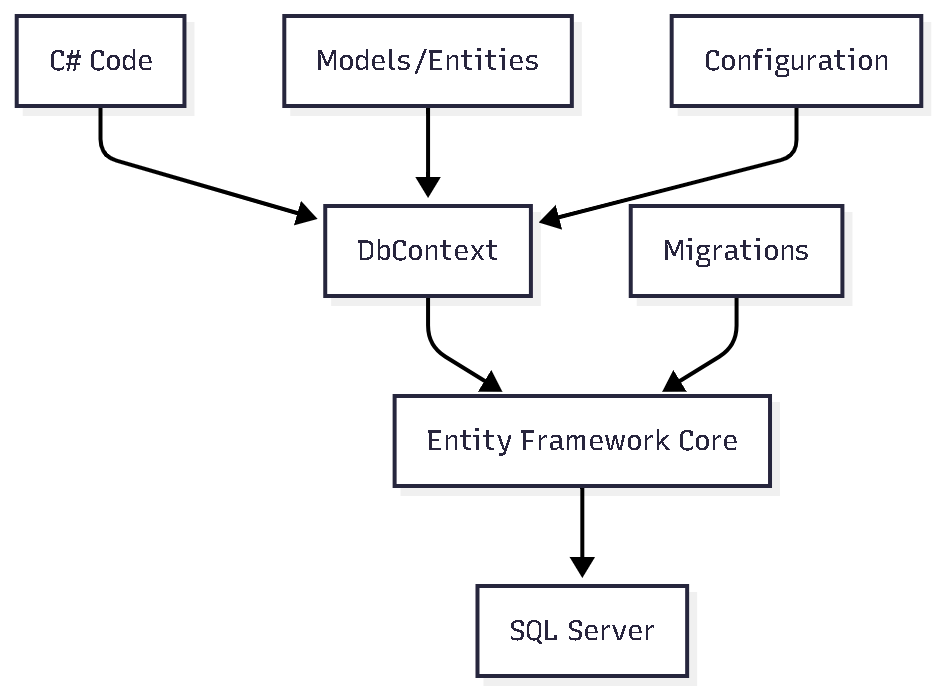

# ORM y Entity Framework Core

## Introducción a Entity Framework Core

**Entity Framework Core (EF Core)** es un ORM (Object-Relational Mapping) moderno y multiplataforma desarrollado por Microsoft para .NET. Permite a los desarrolladores trabajar con bases de datos usando objetos .NET en lugar de escribir SQL directamente. Las aplicaciones ASP.NET Core implementan EF Core con diferentes proveedores de base de datos para gestionar las entidades del dominio.

## Conceptos Fundamentales

### 🗄️ **ORM (Object-Relational Mapping)**

El ORM es una técnica de programación que permite convertir datos entre sistemas de tipos incompatibles en lenguajes orientados a objetos. EF Core actúa como un puente entre el código C# y la base de datos SQL.

### 🏗️ **Entity Framework Core**

EF Core es la versión moderna y multiplataforma de Entity Framework, diseñada para ser ligera, extensible y de alto rendimiento. Proporciona un conjunto de APIs para interactuar con bases de datos de forma declarativa.

## Arquitectura de Entity Framework Core

### 🔄 **Flujo de Trabajo de EF Core**



### 🎯 **Componentes Principales**

#### **1. DbContext**

- Representa una sesión con la base de datos
- Permite consultar y guardar instancias de entidades
- Gestiona el estado de las entidades

#### **2. DbSet**

- Representa una colección de entidades de un tipo específico
- Proporciona operaciones CRUD
- Permite consultas LINQ

#### **3. Migrations**

- Sistema de versionado de esquemas de base de datos
- Permite evolución controlada del modelo
- Genera scripts SQL automáticamente

## Implementación en el Proyecto

### 🏛️ **ApplicationDbContext - Contexto Principal**

```csharp
public class ApplicationDbContext : DbContext
{
    public ApplicationDbContext(DbContextOptions<ApplicationDbContext> options) : base(options) { }

    public DbSet<User> Users { get; set; }
    public DbSet<Role> Roles { get; set; }

    protected override void OnModelCreating(ModelBuilder modelBuilder)
    {
        // Configuración de índices únicos
        modelBuilder.Entity<User>().HasIndex(x => x.UserName).IsUnique();
        modelBuilder.Entity<User>().HasIndex(x => x.Email).IsUnique();
        modelBuilder.Entity<Role>().HasIndex(x => x.Name).IsUnique();

        // Seeding de datos iniciales
        modelBuilder.Entity<Role>().HasData(
            new Role { Id = 1, Name = ROLE.USER },
            new Role { Id = 2, Name = ROLE.ADMIN },
            new Role { Id = 3, Name = ROLE.MOD }
        );

        // Configuración de relaciones many-to-many
        modelBuilder.Entity<User>()
            .HasMany(x => x.Roles)
            .WithMany()
            .UsingEntity<UserRoles>(
                l => l.HasOne<Role>().WithMany().HasForeignKey(x => x.RoleId),
                r => r.HasOne<User>().WithMany().HasForeignKey(x => x.UserId)
            );
    }
}
```

#### **Características del DbContext:**

- **DbSets**: Colecciones de entidades (Users, Roles)
- **Configuración**: Método OnModelCreating para configuraciones avanzadas
- **Índices**: Configuración de índices únicos para optimización
- **Seeding**: Datos iniciales para roles del sistema
- **Relaciones**: Configuración de relaciones many-to-many

### 🏗️ **Configuración de Entidades**

#### **Entidad User**

```csharp
public class User
{
    [Key]
    [DatabaseGenerated(DatabaseGeneratedOption.Identity)]
    public int Id { get; set; }

    public string UserName { get; set; } = null!;
    public string Email { get; set; } = null!;
    public string Password { get; set; } = null!;
    public List<Role.Role> Roles { get; set; } = new();
}
```

#### **Entidad Role**

```csharp
public class Role
{
    [Key]
    [DatabaseGenerated(DatabaseGeneratedOption.Identity)]
    public int Id { get; set; }

    public string Name { get; set; } = null!;
}

public class UserRoles
{
    public int UserId { get; set; }
    public int RoleId { get; set; }
}
```

### 🔗 **Configuración de Relaciones**

#### **Relación Many-to-Many**

```csharp
modelBuilder.Entity<User>()
    .HasMany(x => x.Roles)
    .WithMany()
    .UsingEntity<UserRoles>(
        l => l.HasOne<Role>().WithMany().HasForeignKey(x => x.RoleId),
        r => r.HasOne<User>().WithMany().HasForeignKey(x => x.UserId)
    );
```

#### **Índices Únicos**

```csharp
modelBuilder.Entity<User>().HasIndex(x => x.UserName).IsUnique();
modelBuilder.Entity<User>().HasIndex(x => x.Email).IsUnique();
modelBuilder.Entity<Role>().HasIndex(x => x.Name).IsUnique();
```

## Configuración de Base de Datos

### 🔧 **Configuración en Program.cs**

```csharp
// Configuración de Entity Framework
builder.Services.AddDbContext<ApplicationDbContext>(opts =>
{
    opts.UseSqlServer(builder.Configuration.GetConnectionString("authConnection"));
});
```

### 📋 **Connection String**

```json
{
  "ConnectionStrings": {
    "authConnection": "Server=localhost;Database=AuthDB;Trusted_Connection=true;TrustServerCertificate=true;"
  }
}
```

### 🗄️ **Configuración de SQL Server**

```csharp
// En Program.cs
builder.Services.AddDbContext<ApplicationDbContext>(opts =>
{
    opts.UseSqlServer(
        builder.Configuration.GetConnectionString("authConnection"),
        sqlServerOptions => sqlServerOptions.EnableRetryOnFailure()
    );
});
```

## Enfoques de Desarrollo con Entity Framework

### 🎯 **Code First vs Database First**

Entity Framework Core soporta diferentes enfoques para el desarrollo de aplicaciones:

#### **1. Code First**

- **Definición**: Se crean las entidades en código C# primero
- **Ventajas**: Control total del modelo, versionado automático, migraciones
- **Uso**: Nuevos proyectos, desarrollo ágil
- **Flujo**: Entidades → Migraciones → Base de Datos

#### **2. Database First**

- **Definición**: Se genera el modelo a partir de una base de datos existente
- **Ventajas**: Reutilización de esquemas existentes, integración con sistemas legacy
- **Uso**: Proyectos con bases de datos existentes
- **Flujo**: Base de Datos → Scaffolding → Entidades

#### **3. Model First (Solo EF Framework)**

- **Definición**: Se diseña el modelo visualmente en el diseñador
- **Nota**: No disponible en EF Core, solo en EF Framework

### 🔧 **Herramientas de Entity Framework**

#### **Package Manager Console (Visual Studio)**

```powershell
# Instalar herramientas
Install-Package Microsoft.EntityFrameworkCore.Tools

# Crear migración
Add-Migration InitialCreate

# Actualizar base de datos
Update-Database

# Revertir migración
Update-Database PreviousMigrationName

# Eliminar última migración
Remove-Migration

# Generar script SQL
Script-Migration

# Scaffolding (Database First)
Scaffold-DbContext "Server=localhost;Database=MiDB;Trusted_Connection=true;" Microsoft.EntityFrameworkCore.SqlServer -OutputDir Models
```

#### **Terminal/CLI (.NET CLI)**

```bash
# Instalar herramientas globales
dotnet tool install --global dotnet-ef

# Crear migración
dotnet ef migrations add InitialCreate

# Actualizar base de datos
dotnet ef database update

# Revertir migración
dotnet ef database update PreviousMigrationName

# Eliminar última migración
dotnet ef migrations remove

# Generar script SQL
dotnet ef migrations script

# Scaffolding (Database First)
dotnet ef dbcontext scaffold "Server=localhost;Database=MiDB;Trusted_Connection=true;" Microsoft.EntityFrameworkCore.SqlServer -o Models

# Información de la base de datos
dotnet ef dbcontext info

# Listar migraciones
dotnet ef migrations list
```

### 🏗️ **Code First - Desarrollo Paso a Paso**

#### **1. Crear Entidades**

```csharp
public class Product
{
    public int Id { get; set; }
    public string Name { get; set; } = null!;
    public decimal Price { get; set; }
    public DateTime CreatedAt { get; set; }
    public List<Category> Categories { get; set; } = new();
}

public class Category
{
    public int Id { get; set; }
    public string Name { get; set; } = null!;
    public List<Product> Products { get; set; } = new();
}
```

#### **2. Configurar DbContext**

```csharp
public class ApplicationDbContext : DbContext
{
    public ApplicationDbContext(DbContextOptions<ApplicationDbContext> options) : base(options) { }

    public DbSet<Product> Products { get; set; }
    public DbSet<Category> Categories { get; set; }

    protected override void OnModelCreating(ModelBuilder modelBuilder)
    {
        // Configuraciones específicas
        modelBuilder.Entity<Product>()
            .HasIndex(p => p.Name)
            .IsUnique();
    }
}
```

#### **3. Crear Primera Migración**

```bash
# Terminal
dotnet ef migrations add InitialCreate

# Package Manager Console
Add-Migration InitialCreate
```

#### **4. Aplicar Migración**

```bash
# Terminal
dotnet ef database update

# Package Manager Console
Update-Database
```

### 🗄️ **Database First - Desarrollo Paso a Paso**

#### **1. Tener Base de Datos Existente**

```sql
-- Ejemplo de tabla existente
CREATE TABLE Products (
    Id int IDENTITY(1,1) PRIMARY KEY,
    Name nvarchar(100) NOT NULL,
    Price decimal(18,2) NOT NULL,
    CreatedAt datetime2 NOT NULL
);

CREATE TABLE Categories (
    Id int IDENTITY(1,1) PRIMARY KEY,
    Name nvarchar(50) NOT NULL
);
```

#### **2. Scaffolding (Generar Modelos)**

```bash
# Terminal
dotnet ef dbcontext scaffold "Server=localhost;Database=MiDB;Trusted_Connection=true;" Microsoft.EntityFrameworkCore.SqlServer -o Models -c ApplicationDbContext

# Package Manager Console
Scaffold-DbContext "Server=localhost;Database=MiDB;Trusted_Connection=true;" Microsoft.EntityFrameworkCore.SqlServer -OutputDir Models -Context ApplicationDbContext
```

#### **3. Resultado del Scaffolding**

```csharp
// Archivo generado: Models/Product.cs
public partial class Product
{
    public int Id { get; set; }
    public string Name { get; set; } = null!;
    public decimal Price { get; set; }
    public DateTime CreatedAt { get; set; }
}

// Archivo generado: ApplicationDbContext.cs
public partial class ApplicationDbContext : DbContext
{
    public ApplicationDbContext(DbContextOptions<ApplicationDbContext> options) : base(options) { }

    public virtual DbSet<Product> Products { get; set; }
    public virtual DbSet<Category> Categories { get; set; }
}
```

### 🔄 **Comparación de Enfoques**

| Aspecto                  | Code First  | Database First |
| ------------------------ | ----------- | -------------- |
| **Control del Modelo**   | Total       | Limitado       |
| **Migraciones**          | Automáticas | Manuales       |
| **Versionado**           | Integrado   | Externo        |
| **Flexibilidad**         | Alta        | Media          |
| **Curva de Aprendizaje** | Media       | Baja           |
| **Integración Legacy**   | Difícil     | Fácil          |
| **Desarrollo Ágil**      | Excelente   | Bueno          |

### 🛠️ **Comandos Avanzados**

#### **Migraciones Avanzadas**

```bash
# Crear migración con nombre específico
dotnet ef migrations add AddUserTable

# Crear migración vacía
dotnet ef migrations add EmptyMigration

# Generar script para migración específica
dotnet ef migrations script InitialCreate

# Generar script entre dos migraciones
dotnet ef migrations script InitialCreate AddUserTable

# Aplicar migración a base de datos específica
dotnet ef database update --connection "Server=prod;Database=MyDB;..."
```

#### **Scaffolding Avanzado**

```bash
# Scaffolding con opciones específicas
dotnet ef dbcontext scaffold "ConnectionString" Microsoft.EntityFrameworkCore.SqlServer \
  -o Models \
  -c MyDbContext \
  --table Products \
  --table Categories \
  --force

# Scaffolding con configuración personalizada
dotnet ef dbcontext scaffold "ConnectionString" Microsoft.EntityFrameworkCore.SqlServer \
  -o Models \
  --data-annotations \
  --no-onconfiguring
```

### 📋 **Mejores Prácticas por Enfoque**

#### **Code First - Recomendaciones**

1. **Naming Conventions**: Usar convenciones consistentes
2. **Data Annotations**: Preferir Fluent API para configuraciones complejas
3. **Migrations**: Crear migraciones pequeñas y frecuentes
4. **Testing**: Usar In-Memory Database para tests

#### **Database First - Recomendaciones**

1. **Scaffolding**: Ejecutar regularmente para sincronizar cambios
2. **Partial Classes**: Usar clases parciales para extensiones
3. **Configuration**: Separar configuraciones en archivos específicos
4. **Versioning**: Mantener control de versiones de la base de datos

## Migraciones

### 🌱 **Sistema de Migraciones**

Las migraciones permiten evolucionar el esquema de la base de datos de forma controlada y versionada.

### 📄 **Estructura de Migración**

```csharp
public partial class AuthImplemented : Migration
{
    protected override void Up(MigrationBuilder migrationBuilder)
    {
        // Crear tablas
        migrationBuilder.CreateTable(
            name: "Users",
            columns: table => new
            {
                Id = table.Column<int>(type: "int", nullable: false)
                    .Annotation("SqlServer:Identity", "1, 1"),
                UserName = table.Column<string>(type: "nvarchar(450)", nullable: false),
                Email = table.Column<string>(type: "nvarchar(450)", nullable: false),
                Password = table.Column<string>(type: "nvarchar(max)", nullable: false)
            },
            constraints: table =>
            {
                table.PrimaryKey("PK_Users", x => x.Id);
            });

        // Crear índices
        migrationBuilder.CreateIndex(
            name: "IX_Users_Email",
            table: "Users",
            column: "Email",
            unique: true);
    }

    protected override void Down(MigrationBuilder migrationBuilder)
    {
        // Revertir cambios
        migrationBuilder.DropTable(name: "Users");
    }
}
```

### 🔄 **Flujo de Migraciones**


## Operaciones CRUD

### 📖 **Consultas (Queries)**

#### **Consultas Básicas**

```csharp
// Obtener todos los usuarios
var users = await _context.Users.ToListAsync();

// Obtener usuario por ID
var user = await _context.Users.FindAsync(id);

// Consulta con filtros
var user = await _context.Users
    .Where(u => u.Email == email)
    .FirstOrDefaultAsync();
```

#### **Consultas con Inclusión (Include)**

```csharp
// Incluir roles en la consulta
var user = await _context.Users
    .Include(u => u.Roles)
    .FirstOrDefaultAsync(u => u.Id == userId);
```

#### **Consultas LINQ**

```csharp
// Consulta compleja
var usersWithRoles = await _context.Users
    .Where(u => u.Roles.Any(r => r.Name == "Admin"))
    .Include(u => u.Roles)
    .ToListAsync();
```

### ✏️ **Crear (Create)**

```csharp
public async Task<User> CreateUserAsync(User user)
{
    _context.Users.Add(user);
    await _context.SaveChangesAsync();
    return user;
}
```

### 🔄 **Actualizar (Update)**

```csharp
public async Task<User> UpdateUserAsync(User user)
{
    _context.Users.Update(user);
    await _context.SaveChangesAsync();
    return user;
}
```

### 🗑️ **Eliminar (Delete)**

```csharp
public async Task DeleteUserAsync(int userId)
{
    var user = await _context.Users.FindAsync(userId);
    if (user != null)
    {
        _context.Users.Remove(user);
        await _context.SaveChangesAsync();
    }
}
```

## Configuración Avanzada

### 🎯 **Configuraciones por Entidad**

```csharp
protected override void OnModelCreating(ModelBuilder modelBuilder)
{
    // Configuración de User
    modelBuilder.Entity<User>(entity =>
    {
        entity.HasKey(e => e.Id);
        entity.Property(e => e.UserName).HasMaxLength(50).IsRequired();
        entity.Property(e => e.Email).HasMaxLength(100).IsRequired();
        entity.Property(e => e.Password).HasMaxLength(255).IsRequired();
    });

    // Configuración de Role
    modelBuilder.Entity<Role>(entity =>
    {
        entity.HasKey(e => e.Id);
        entity.Property(e => e.Name).HasMaxLength(50).IsRequired();
    });
}
```

### 🔍 **Configuración de Índices**

```csharp
// Índice único
modelBuilder.Entity<User>()
    .HasIndex(u => u.Email)
    .IsUnique();

// Índice compuesto
modelBuilder.Entity<User>()
    .HasIndex(u => new { u.UserName, u.Email });

// Índice con filtro
modelBuilder.Entity<User>()
    .HasIndex(u => u.Email)
    .HasFilter("[Email] IS NOT NULL");
```

### 🌱 **Seeding de Datos**

```csharp
protected override void OnModelCreating(ModelBuilder modelBuilder)
{
    // Seeding de roles
    modelBuilder.Entity<Role>().HasData(
        new Role { Id = 1, Name = "User" },
        new Role { Id = 2, Name = "Admin" },
        new Role { Id = 3, Name = "Moderator" }
    );

    // Seeding de usuarios de prueba
    modelBuilder.Entity<User>().HasData(
        new User
        {
            Id = 1,
            UserName = "admin",
            Email = "admin@example.com",
            Password = BCrypt.Net.BCrypt.HashPassword("password123")
        }
    );
}
```

## Rendimiento y Optimización

### ⚡ **Mejores Prácticas de Rendimiento**

#### **1. Consultas Eficientes**

```csharp
// ❌ Malo - N+1 Problem
var users = await _context.Users.ToListAsync();
foreach (var user in users)
{
    var roles = await _context.Roles.Where(r => r.Users.Contains(user)).ToListAsync();
}

// ✅ Bueno - Include
var users = await _context.Users
    .Include(u => u.Roles)
    .ToListAsync();
```

#### **2. Proyecciones**

```csharp
// Solo obtener campos necesarios
var userNames = await _context.Users
    .Select(u => new { u.Id, u.UserName })
    .ToListAsync();
```

#### **3. Paginación**

```csharp
public async Task<PagedResult<User>> GetUsersPagedAsync(int page, int pageSize)
{
    var totalCount = await _context.Users.CountAsync();
    var users = await _context.Users
        .Skip((page - 1) * pageSize)
        .Take(pageSize)
        .ToListAsync();

    return new PagedResult<User>
    {
        Data = users,
        TotalCount = totalCount,
        Page = page,
        PageSize = pageSize
    };
}
```

### 🔧 **Configuración de Rendimiento**

```csharp
// Configuración optimizada
builder.Services.AddDbContext<ApplicationDbContext>(opts =>
{
    opts.UseSqlServer(connectionString, options =>
    {
        options.EnableRetryOnFailure(maxRetryCount: 3);
        options.CommandTimeout(30);
    });

    // Configuración de rendimiento
    opts.EnableSensitiveDataLogging(false);
    opts.EnableServiceProviderCaching();
    opts.EnableDetailedErrors(false);
});
```

## Manejo de Transacciones

### 🔄 **Transacciones Explícitas**

```csharp
public async Task<bool> CreateUserWithRoleAsync(User user, string roleName)
{
    using var transaction = await _context.Database.BeginTransactionAsync();
    try
    {
        // Crear usuario
        _context.Users.Add(user);
        await _context.SaveChangesAsync();

        // Asignar rol
        var role = await _context.Roles.FirstOrDefaultAsync(r => r.Name == roleName);
        if (role != null)
        {
            user.Roles.Add(role);
            await _context.SaveChangesAsync();
        }

        await transaction.CommitAsync();
        return true;
    }
    catch
    {
        await transaction.RollbackAsync();
        return false;
    }
}
```

### 🎯 **Transacciones Automáticas**

```csharp
// EF Core maneja transacciones automáticamente
public async Task<User> CreateUserAsync(User user)
{
    _context.Users.Add(user);
    await _context.SaveChangesAsync(); // Transacción automática
    return user;
}
```

## Testing con Entity Framework

### 🧪 **Testing con In-Memory Database**

```csharp
[Test]
public async Task CreateUser_ShouldReturnUser()
{
    // Arrange
    var options = new DbContextOptionsBuilder<ApplicationDbContext>()
        .UseInMemoryDatabase(databaseName: "TestDb")
        .Options;

    using var context = new ApplicationDbContext(options);
    var repository = new UserRepository(context);

    // Act
    var user = new User { UserName = "test", Email = "test@example.com" };
    var result = await repository.CreateOneAsync(user);

    // Assert
    Assert.IsNotNull(result);
    Assert.AreEqual("test", result.UserName);
}
```

## Ventajas de Entity Framework Core

### ✅ **Beneficios**

1. **Productividad**: Desarrollo más rápido con menos código
2. **Type Safety**: Verificación de tipos en tiempo de compilación
3. **LINQ**: Consultas fuertemente tipadas
4. **Migrations**: Control de versiones del esquema
5. **Cross-Platform**: Funciona en Windows, Linux y macOS
6. **Performance**: Optimizado para alto rendimiento
7. **Extensibilidad**: Fácil de extender y personalizar

### 🎯 **Casos de Uso Ideales**

- Aplicaciones que requieren mapeo objeto-relacional
- Proyectos con esquemas de base de datos complejos
- Aplicaciones que necesitan migraciones automáticas
- Sistemas que requieren consultas LINQ
- Proyectos que necesitan testing con bases de datos

## Mejores Prácticas

### 📋 **Recomendaciones**

1. **DbContext Lifecycle**: Usar Scoped para web applications
2. **Connection Management**: Dejar que EF Core maneje conexiones
3. **Query Optimization**: Usar Include() para evitar N+1 queries
4. **Migration Strategy**: Planificar migraciones cuidadosamente
5. **Error Handling**: Implementar manejo robusto de errores
6. **Logging**: Configurar logging apropiado para debugging

### ⚠️ **Consideraciones**

1. **Performance**: Monitorear rendimiento de consultas
2. **Memory Usage**: Gestionar memoria para consultas grandes
3. **Migration Conflicts**: Resolver conflictos en equipos
4. **Database Locking**: Considerar bloqueos en operaciones largas
5. **Connection Pooling**: Configurar pooling apropiadamente
