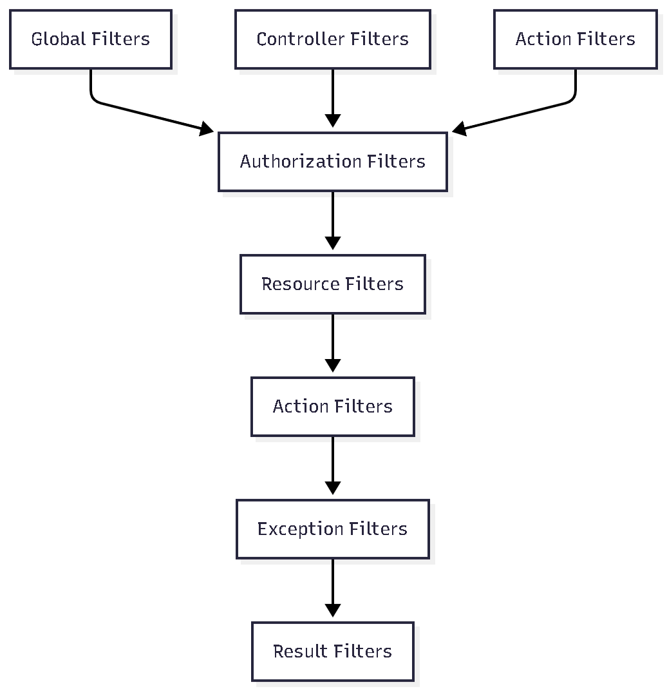

# Filtros y Swagger/OpenAPI

## Introducción a Filtros y Swagger

Los **Filtros** y **Swagger/OpenAPI** son componentes esenciales en ASP.NET Core que proporcionan funcionalidades de middleware, documentación automática de APIs y manejo de requests/responses. Las aplicaciones ASP.NET Core implementan sistemas robustos de filtros personalizados y documentación automática con Swagger.

## Conceptos Fundamentales

### 🔍 **Filtros (Filters)**

Los filtros en ASP.NET Core permiten ejecutar código antes o después de ciertas etapas en el pipeline de procesamiento de requests. Proporcionan una forma de implementar lógica cross-cutting como logging, validación, autorización y manejo de errores.

### 📚 **Swagger/OpenAPI**

Swagger es una especificación para describir APIs REST, mientras que OpenAPI es el estándar que define cómo documentar APIs. En ASP.NET Core, Swashbuckle proporciona la implementación que genera automáticamente documentación interactiva de APIs.

## Tipos de Filtros en ASP.NET Core

### 🎯 **Jerarquía de Filtros**



### 📋 **Tipos de Filtros**

1. **Authorization Filters**: Controlan el acceso a recursos
2. **Resource Filters**: Ejecutan antes y después del resto del pipeline
3. **Action Filters**: Ejecutan antes y después de la ejecución de acciones
4. **Exception Filters**: Manejan excepciones no controladas
5. **Result Filters**: Ejecutan antes y después de la ejecución de resultados

## Implementación de Filtros Personalizados

### 🔐 **AuthOperationFilter - Filtro de Swagger**

```csharp
public class AuthOperationFilter : IOperationFilter
{
    public void Apply(OpenApiOperation operation, OperationFilterContext context)
    {
        var Attributes = context.ApiDescription.CustomAttributes();
        bool IsAuthorize = Attributes.Any(attr => attr.GetType() == typeof(AuthorizeAttribute));
        bool IsAllowAnonymous = Attributes.Any(attr => attr.GetType() == typeof(AllowAnonymousAttribute));

        if (!IsAuthorize || IsAllowAnonymous) return;

        var reference = new OpenApiReference
        {
            Type = ReferenceType.SecurityScheme,
            Id = "Token"
        };

        var securityScheme = new OpenApiSecurityScheme
        {
            Reference = reference,
        };

        var requirement = new OpenApiSecurityRequirement
        {
            [securityScheme] = []
        };

        operation.Security = new List<OpenApiSecurityRequirement> {
            requirement
        };
    }
}
```

#### **Características del AuthOperationFilter:**

- **Detección Automática**: Detecta endpoints que requieren autenticación
- **Configuración de Seguridad**: Aplica esquemas de seguridad JWT
- **Documentación**: Genera documentación automática de autenticación
- **Flexibilidad**: Maneja tanto endpoints protegidos como públicos

### 🛡️ **Filtros de Validación Personalizados**

```csharp
public class ValidationFilter : IActionFilter
{
    public void OnActionExecuting(ActionExecutingContext context)
    {
        if (!context.ModelState.IsValid)
        {
            var errors = context.ModelState
                .Where(x => x.Value.Errors.Count > 0)
                .ToDictionary(
                    kvp => kvp.Key,
                    kvp => kvp.Value.Errors.Select(e => e.ErrorMessage).ToArray()
                );

            context.Result = new BadRequestObjectResult(new
            {
                Message = "Validation failed",
                Errors = errors
            });
        }
    }

    public void OnActionExecuted(ActionExecutedContext context)
    {
        // Lógica post-ejecución si es necesaria
    }
}
```

### 📝 **Filtro de Logging**

```csharp
public class LoggingFilter : IActionFilter
{
    private readonly ILogger<LoggingFilter> _logger;

    public LoggingFilter(ILogger<LoggingFilter> logger)
    {
        _logger = logger;
    }

    public void OnActionExecuting(ActionExecutingContext context)
    {
        _logger.LogInformation(
            "Executing action {ActionName} with parameters {@Parameters}",
            context.ActionDescriptor.DisplayName,
            context.ActionArguments
        );
    }

    public void OnActionExecuted(ActionExecutedContext context)
    {
        _logger.LogInformation(
            "Executed action {ActionName} with result {Result}",
            context.ActionDescriptor.DisplayName,
            context.Result
        );
    }
}
```

### ⚠️ **Filtro de Manejo de Excepciones**

```csharp
public class GlobalExceptionFilter : IExceptionFilter
{
    private readonly ILogger<GlobalExceptionFilter> _logger;

    public GlobalExceptionFilter(ILogger<GlobalExceptionFilter> logger)
    {
        _logger = logger;
    }

    public void OnException(ExceptionContext context)
    {
        _logger.LogError(context.Exception, "An unhandled exception occurred");

        var response = new
        {
            Message = "An error occurred while processing your request",
            Details = context.Exception.Message,
            Timestamp = DateTime.UtcNow
        };

        context.Result = new ObjectResult(response)
        {
            StatusCode = 500
        };

        context.ExceptionHandled = true;
    }
}
```

## Configuración de Swagger/OpenAPI

### 🔧 **Configuración Básica en Program.cs**

```csharp
builder.Services.AddSwaggerGen(options => {
    options.SwaggerDoc("v1", new OpenApiInfo
    {
        Version = "v1",
        Title = "Auth API",
        Description = "An ASP.NET Core Web Api for managing Auth"
    });

    options.AddSecurityDefinition("Token", new OpenApiSecurityScheme()
    {
        BearerFormat = "JWT",
        Description = "JWT Authorization header using the Bearer Scheme.",
        In = ParameterLocation.Header,
        Type = SecuritySchemeType.Http,
        Name = "Authorization",
        Scheme = "bearer"
    });

    options.OperationFilter<AuthOperationFilter>();
});
```

### 🛡️ **Configuración de Seguridad JWT**

```csharp
options.AddSecurityDefinition("Token", new OpenApiSecurityScheme()
{
    BearerFormat = "JWT",
    Description = "JWT Authorization header using the Bearer Scheme.",
    In = ParameterLocation.Header,
    Type = SecuritySchemeType.Http,
    Name = "Authorization",
    Scheme = "bearer"
});
```

### 📋 **Configuración Avanzada de Swagger**

```csharp
builder.Services.AddSwaggerGen(options =>
{
    // Información básica
    options.SwaggerDoc("v1", new OpenApiInfo
    {
        Title = "Auth API",
        Version = "v1",
        Description = "API de autenticación con JWT",
        Contact = new OpenApiContact
        {
            Name = "Equipo de Desarrollo",
            Email = "dev@example.com"
        },
        License = new OpenApiLicense
        {
            Name = "MIT License",
            Url = new Uri("https://opensource.org/licenses/MIT")
        }
    });

    // Incluir comentarios XML
    var xmlFile = $"{Assembly.GetExecutingAssembly().GetName().Name}.xml";
    var xmlPath = Path.Combine(AppContext.BaseDirectory, xmlFile);
    options.IncludeXmlComments(xmlPath);

    // Configuración de esquemas
    options.SchemaFilter<ExampleSchemaFilter>();
    options.OperationFilter<AuthOperationFilter>();
});
```

## Utilidades y Helpers

### 📨 **HttpMessage - Clase de Respuesta**

```csharp
public class HttpMessage
{
    public string Message { get; set; }

    public HttpMessage(string message)
    {
        Message = message;
    }
}
```

#### **Uso en Controladores:**

```csharp
[HttpPost("login")]
public async Task<ActionResult<LoginResponseDTO>> Login([FromBody] LoginDTO login)
{
    try
    {
        var result = await _authServices.Login(login, HttpContext);
        return Ok(result);
    }
    catch (HttpResponseError ex)
    {
        return StatusCode(
            (int)ex.StatusCode,
            new HttpMessage(ex.Message)
        );
    }
}
```

### ⚠️ **HttpResponseError - Excepción Personalizada**

```csharp
public class HttpResponseError : Exception
{
    public string Message { get; set; }
    public HttpStatusCode StatusCode { get; set; }

    public HttpResponseError(HttpStatusCode statusCode, string message) : base(message)
    {
        StatusCode = statusCode;
        Message = message;
    }
}
```

#### **Uso en Servicios:**

```csharp
public async Task<User> GetUserAsync(int userId)
{
    var user = await _userRepository.GetOneAsync(u => u.Id == userId);

    if (user == null)
    {
        throw new HttpResponseError(HttpStatusCode.NotFound, "User not found");
    }

    return user;
}
```

## Documentación Automática

### 📚 **Atributos de Documentación**

```csharp
[HttpPost("register")]
[ProducesResponseType(typeof(User), StatusCodes.Status201Created)]
[ProducesResponseType(typeof(HttpMessage), StatusCodes.Status400BadRequest)]
[ProducesResponseType(typeof(HttpMessage), StatusCodes.Status500InternalServerError)]
public async Task<ActionResult<User>> Register([FromBody] RegisterDTO register)
{
    // Implementación
}
```

### 🏷️ **Etiquetas y Agrupación**

```csharp
[ApiController]
[Route("api/[controller]")]
[Tags("Authentication")]
public class AuthController : ControllerBase
{
    // Endpoints agrupados bajo "Authentication"
}
```

### 📝 **Ejemplos en Documentación**

```csharp
[HttpPost("login")]
[SwaggerOperation(
    Summary = "Autenticar usuario",
    Description = "Autentica un usuario y retorna un token JWT"
)]
[SwaggerResponse(200, "Login exitoso", typeof(LoginResponseDTO))]
[SwaggerResponse(400, "Credenciales inválidas", typeof(HttpMessage))]
public async Task<ActionResult<LoginResponseDTO>> Login([FromBody] LoginDTO login)
{
    // Implementación
}
```

## Configuración de Middleware

### 🔄 **Pipeline de Middleware**

```csharp
var app = builder.Build();

// Configuración de CORS
app.UseCors(opts =>
{
    opts.AllowAnyMethod();
    opts.AllowAnyHeader();
    opts.AllowCredentials();
    opts.WithOrigins("http://localhost:5173");
});

// Swagger en desarrollo
if (app.Environment.IsDevelopment())
{
    app.UseSwagger();
    app.UseSwaggerUI(c =>
    {
        c.SwaggerEndpoint("/swagger/v1/swagger.json", "Auth API v1");
        c.RoutePrefix = string.Empty; // Swagger UI en la raíz
    });
}

// Middleware de autenticación y autorización
app.UseAuthentication();
app.UseAuthorization();

app.MapControllers();
```

### 🛡️ **Configuración de CORS**

```csharp
builder.Services.AddCors(options =>
{
    options.AddPolicy("AllowSpecificOrigin", policy =>
    {
        policy.WithOrigins("http://localhost:5173")
              .AllowAnyMethod()
              .AllowAnyHeader()
              .AllowCredentials();
    });
});
```

## Filtros Globales

### 🌐 **Registro de Filtros Globales**

```csharp
builder.Services.AddControllers(options =>
{
    options.Filters.Add<GlobalExceptionFilter>();
    options.Filters.Add<ValidationFilter>();
    options.Filters.Add<LoggingFilter>();
});
```

### 🎯 **Filtros por Controlador**

```csharp
[ApiController]
[Route("api/[controller]")]
[ServiceFilter(typeof(ValidationFilter))]
public class AuthController : ControllerBase
{
    // Todos los endpoints del controlador usan el filtro
}
```

### 🔧 **Filtros por Acción**

```csharp
[HttpPost("register")]
[ServiceFilter(typeof(ValidationFilter))]
[ServiceFilter(typeof(LoggingFilter))]
public async Task<ActionResult<User>> Register([FromBody] RegisterDTO register)
{
    // Solo este endpoint usa estos filtros
}
```

## Testing con Filtros

### 🧪 **Testing de Filtros Personalizados**

```csharp
[Test]
public void AuthOperationFilter_WithAuthorizeAttribute_AddsSecurityRequirement()
{
    // Arrange
    var filter = new AuthOperationFilter();
    var operation = new OpenApiOperation();
    var context = new OperationFilterContext(
        new ApiDescription(),
        new SchemaGenerator(new SchemaGeneratorOptions(), new JsonSerializerDataContractResolver(new JsonSerializerOptions())),
        new SchemaRepository(),
        typeof(AuthController).GetMethod("Login")
    );

    // Act
    filter.Apply(operation, context);

    // Assert
    Assert.IsNotNull(operation.Security);
    Assert.IsTrue(operation.Security.Count > 0);
}
```

### 🔍 **Testing de Filtros de Validación**

```csharp
[Test]
public void ValidationFilter_WithInvalidModel_ReturnsBadRequest()
{
    // Arrange
    var filter = new ValidationFilter();
    var context = new ActionExecutingContext(
        new ActionContext(),
        new List<IFilterMetadata>(),
        new Dictionary<string, object>(),
        new AuthController()
    );

    context.ModelState.AddModelError("Email", "Email is required");

    // Act
    filter.OnActionExecuting(context);

    // Assert
    Assert.IsInstanceOf<BadRequestObjectResult>(context.Result);
}
```

## Mejores Prácticas

### 📋 **Recomendaciones para Filtros**

1. **Single Responsibility**: Cada filtro una responsabilidad específica
2. **Performance**: Considerar el impacto en rendimiento
3. **Logging**: Registrar operaciones importantes
4. **Error Handling**: Manejo consistente de errores
5. **Testing**: Facilitar testing con interfaces
6. **Documentation**: Documentar comportamiento de filtros

### 📋 **Recomendaciones para Swagger**

1. **Documentación Completa**: Documentar todos los endpoints
2. **Ejemplos**: Proporcionar ejemplos de requests/responses
3. **Seguridad**: Configurar esquemas de seguridad apropiados
4. **Versionado**: Manejar versiones de API correctamente
5. **Validación**: Validar documentación generada
6. **Mantenimiento**: Mantener documentación actualizada

### ⚠️ **Consideraciones**

1. **Performance**: Filtros pueden impactar rendimiento
2. **Complejidad**: No sobre-complicar con demasiados filtros
3. **Debugging**: Facilitar debugging y troubleshooting
4. **Security**: Considerar implicaciones de seguridad
5. **Maintenance**: Mantener filtros actualizados

## Ejemplos Avanzados

### 🔄 **Filtro de Rate Limiting**

```csharp
public class RateLimitFilter : IActionFilter
{
    private readonly IMemoryCache _cache;
    private readonly int _maxRequests;
    private readonly TimeSpan _timeWindow;

    public RateLimitFilter(IMemoryCache cache, int maxRequests = 100, int timeWindowMinutes = 1)
    {
        _cache = cache;
        _maxRequests = maxRequests;
        _timeWindow = TimeSpan.FromMinutes(timeWindowMinutes);
    }

    public void OnActionExecuting(ActionExecutingContext context)
    {
        var clientIp = context.HttpContext.Connection.RemoteIpAddress?.ToString();
        var key = $"rate_limit_{clientIp}";

        if (_cache.TryGetValue(key, out int requestCount))
        {
            if (requestCount >= _maxRequests)
            {
                context.Result = new StatusCodeResult(429); // Too Many Requests
                return;
            }
            _cache.Set(key, requestCount + 1, _timeWindow);
        }
        else
        {
            _cache.Set(key, 1, _timeWindow);
        }
    }
}
```

### 📊 **Filtro de Métricas**

```csharp
public class MetricsFilter : IActionFilter
{
    private readonly IMetrics _metrics;

    public MetricsFilter(IMetrics metrics)
    {
        _metrics = metrics;
    }

    public void OnActionExecuting(ActionExecutingContext context)
    {
        context.HttpContext.Items["StartTime"] = DateTime.UtcNow;
    }

    public void OnActionExecuted(ActionExecutedContext context)
    {
        if (context.HttpContext.Items["StartTime"] is DateTime startTime)
        {
            var duration = DateTime.UtcNow - startTime;
            _metrics.Measure.Timer.Time("api.request.duration", duration);
        }
    }
}
```
