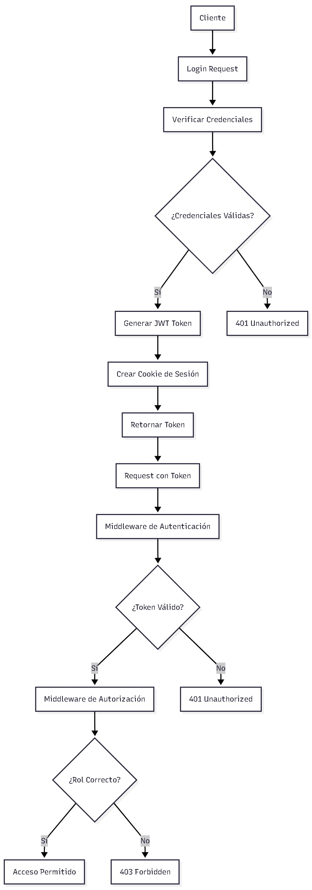

# Autenticación y Autorización

## Introducción a Autenticación y Autorización

La **Autenticación** y **Autorización** son componentes fundamentales de seguridad en aplicaciones web que controlan el acceso a recursos y funcionalidades. Las aplicaciones ASP.NET Core implementan sistemas robustos que combinan JWT (JSON Web Tokens), cookies de sesión, y sistemas de roles para proporcionar seguridad completa.

## Conceptos Fundamentales

### 🔐 **Autenticación (Authentication)**

La autenticación es el proceso de verificar la identidad de un usuario. Responde a la pregunta: "¿Quién eres?" y confirma que el usuario es quien dice ser.

### 🛡️ **Autorización (Authorization)**

La autorización es el proceso de determinar qué acciones puede realizar un usuario autenticado. Responde a la pregunta: "¿Qué puedes hacer?" y controla el acceso a recursos específicos.

### 🎯 **Diferencia Clave**

- **Autenticación**: "¿Eres realmente quien dices ser?"
- **Autorización**: "¿Tienes permiso para hacer esto?"

## Arquitectura de Seguridad

### 🔄 **Flujo de Autenticación y Autorización**



### 🏗️ **Componentes del Sistema de Seguridad**

1. **JWT Tokens**: Autenticación stateless
2. **Cookies de Sesión**: Autenticación stateful
3. **Sistema de Roles**: Autorización basada en roles
4. **BCrypt**: Encriptación de contraseñas
5. **Middleware**: Pipeline de seguridad

## Implementación de Autenticación

### 🔑 **Configuración de JWT en Program.cs**

```csharp
// Configuración de JWT
var secret = builder.Configuration.GetSection("Secrets:JWT")?.Value?.ToString() ?? string.Empty;
var key = Encoding.UTF8.GetBytes(secret);

builder.Services.AddAuthentication(options =>
{
    options.DefaultAuthenticateScheme = CookieAuthenticationDefaults.AuthenticationScheme;
    options.DefaultChallengeScheme = JwtBearerDefaults.AuthenticationScheme;
    options.DefaultScheme = JwtBearerDefaults.AuthenticationScheme;
})
.AddJwtBearer(opts =>
{
    opts.SaveToken = true;
    opts.TokenValidationParameters = new TokenValidationParameters
    {
        ValidateIssuerSigningKey = true,
        IssuerSigningKey = new SymmetricSecurityKey(key),
        ValidateIssuer = false,
        ValidateAudience = false,
        ValidateLifetime = true,
    };
})
.AddCookie(opts =>
{
    opts.Cookie.HttpOnly = true;
    opts.Cookie.SameSite = SameSiteMode.None;
    opts.Cookie.SecurePolicy = CookieSecurePolicy.Always;
    opts.ExpireTimeSpan = TimeSpan.FromDays(1);
});
```

#### **Características de la Configuración:**

- **Dual Authentication**: Soporte para JWT y Cookies
- **Token Validation**: Validación completa de tokens JWT
- **Cookie Security**: Configuración segura de cookies
- **Flexible Schemes**: Múltiples esquemas de autenticación

### 🎫 **Generación de Tokens JWT**

```csharp
public string GenerateJwt(User user)
{
    var key = Encoding.UTF8.GetBytes(_secret);
    var symmetricKey = new SymmetricSecurityKey(key);

    var credentials = new SigningCredentials(
        symmetricKey,
        SecurityAlgorithms.HmacSha256Signature
    );

    var claims = new List<Claim>
    {
        new Claim("id", user.Id.ToString())
    };

    // Agregar roles como claims
    if (user.Roles != null && user.Roles.Count > 0)
    {
        foreach (var role in user.Roles)
        {
            var claim = new Claim(ClaimTypes.Role, role.Name);
            claims.Add(claim);
        }
    }

    var tokenDescriptor = new SecurityTokenDescriptor()
    {
        Subject = new ClaimsIdentity(claims),
        Expires = DateTime.UtcNow.AddDays(1),
        SigningCredentials = credentials
    };

    var tokenHandler = new JwtSecurityTokenHandler();
    var tokenConfig = tokenHandler.CreateToken(tokenDescriptor);
    string token = tokenHandler.WriteToken(tokenConfig);

    return token;
}
```

#### **Características del Token JWT:**

- **Claims**: Información del usuario y roles
- **Expiration**: Tiempo de vida configurable
- **Signing**: Firma segura con HMAC SHA256
- **Standards**: Compatible con estándares JWT

### 🍪 **Gestión de Cookies de Sesión**

```csharp
public async Task SetCookie(User user, HttpContext context)
{
    var claims = new List<Claim>
    {
        new Claim("id", user.Id.ToString())
    };

    if (user.Roles != null && user.Roles.Count > 0)
    {
        foreach (var role in user.Roles)
        {
            var claim = new Claim(ClaimTypes.Role, role.Name);
            claims.Add(claim);
        }
    }

    var identity = new ClaimsIdentity(claims, CookieAuthenticationDefaults.AuthenticationScheme);
    var principal = new ClaimsPrincipal(identity);

    await context.SignInAsync(
        CookieAuthenticationDefaults.AuthenticationScheme,
        principal,
        new AuthenticationProperties
        {
            IsPersistent = true,
            ExpiresUtc = DateTime.UtcNow.AddDays(7)
        }
    );
}
```

#### **Características de las Cookies:**

- **Claims-based**: Basadas en claims de identidad
- **Persistent**: Persisten entre sesiones del navegador
- **Secure**: Configuración de seguridad apropiada
- **Expiration**: Tiempo de vida configurable

## Sistema de Roles y Autorización

### 🛡️ **Definición de Roles**

```csharp
public static class ROLE
{
    public const string USER = "User";
    public const string ADMIN = "Admin";
    public const string MOD = "Mod";
}
```

### 🎯 **Configuración de Autorización**

```csharp
[HttpGet("health")]
[Authorize(Roles = $"{ROLE.USER}, {ROLE.MOD}")]
public bool Health()
{
    return true;
}
```

#### **Niveles de Autorización:**

- **USER**: Usuario básico del sistema
- **MOD**: Moderador con permisos extendidos
- **ADMIN**: Administrador con acceso completo

Puedes tener más roles si lo deseas.

Puedes usar el decorador [Authorize] para proteger un endpoint. También puedes usar el decorador [AllowAnonymous] para permitir el acceso a un endpoint sin autenticación.

### 🔐 **Middleware de Autenticación y Autorización**

```csharp
// En Program.cs
app.UseAuthentication();
app.UseAuthorization();
```

#### **Orden del Middleware:**

1. **CORS**: Configuración de origen cruzado
2. **HTTPS Redirection**: Redirección segura
3. **Authentication**: Verificación de identidad
4. **Authorization**: Verificación de permisos
5. **Controllers**: Ejecución de controladores

## Implementación de Servicios de Autenticación

### 🔐 **AuthServices - Servicio Principal**

```csharp
public class AuthServices
{
    private readonly UserServices _userServices;
    private readonly IEncoderServices _encoderServices;
    private readonly IMapper _mapper;
    private readonly IConfiguration _config;

    public async Task<LoginResponseDTO> Login(LoginDTO login, HttpContext context)
    {
        // 1. Buscar usuario
        var user = await _userServices.GetOneByEmailOrUsername(login.EmailOrUsername, login.EmailOrUsername);

        if (user == null)
        {
            throw new HttpResponseError(HttpStatusCode.BadRequest, "Invalid credentials");
        }

        // 2. Verificar contraseña
        bool IsMatch = _encoderServices.Verify(login.Password, user.Password);
        if (!IsMatch) {
            throw new HttpResponseError(HttpStatusCode.BadRequest, "Invalid credentials");
        }

        // 3. Crear sesión y token
        await SetCookie(user, context);
        string token = GenerateJwt(user);

        return new LoginResponseDTO {
            Token = token,
            User = _mapper.Map<UserWithoutPassDTO>(user)
        };
    }

    public async Task Logout(HttpContext context)
    {
        await context.SignOutAsync(CookieAuthenticationDefaults.AuthenticationScheme);
    }
}
```

### 🔒 **EncoderServices - Encriptación de Contraseñas**

```csharp
public interface IEncoderServices
{
    string Encode(string value);
    bool Verify(string value, string hash);
}

public class EncoderServices : IEncoderServices
{
    public string Encode(string value)
    {
        var salt = BC.GenerateSalt(13);
        string encoded = BC.HashPassword(value, salt);
        return encoded;
    }

    public bool Verify(string value, string hash)
    {
        bool matched = BC.Verify(value, hash);
        return matched;
    }
}
```

#### **Características de BCrypt:**

- **Salt Generation**: Generación automática de salt
- **Hash Verification**: Verificación segura de contraseñas
- **Industry Standard**: Estándar de la industria
- **Secure**: Resistente a ataques de fuerza bruta

## Endpoints de Autenticación

### 📝 **Registro de Usuario**

```csharp
[HttpPost("register")]
[ProducesResponseType(typeof(User), StatusCodes.Status201Created)]
[ProducesResponseType(typeof(HttpMessage), StatusCodes.Status400BadRequest)]
public async Task<ActionResult<User>> Register([FromBody] RegisterDTO register)
{
    try
    {
        var created = await _authServices.Register(register);
        return Created("Register", created);
    }
    catch (HttpResponseError ex)
    {
        return StatusCode((int)ex.StatusCode, new HttpMessage(ex.Message));
    }
}
```

### 🔑 **Login de Usuario**

```csharp
[HttpPost("login")]
[ProducesResponseType(typeof(LoginResponseDTO), StatusCodes.Status200OK)]
[ProducesResponseType(typeof(HttpMessage), StatusCodes.Status400BadRequest)]
public async Task<ActionResult<LoginResponseDTO>> Login([FromBody] LoginDTO login)
{
    try
    {
        var result = await _authServices.Login(login, HttpContext);
        return Ok(result);
    }
    catch (HttpResponseError ex)
    {
        return StatusCode((int)ex.StatusCode, new HttpMessage(ex.Message));
    }
}
```

### 🚪 **Logout de Usuario**

```csharp
[HttpPost("logout")]
[Authorize]
[ProducesResponseType(StatusCodes.Status200OK)]
public async Task<IActionResult> Logout()
{
    try
    {
        await _authServices.Logout(HttpContext);
        return Ok();
    }
    catch (Exception ex)
    {
        return StatusCode(500, new HttpMessage(ex.Message));
    }
}
```

### 🏥 **Health Check (Protegido)**

```csharp
[HttpGet("health")]
[Authorize(Roles = $"{ROLE.USER}, {ROLE.MOD}")]
public bool Health()
{
    return true;
}
```

## Configuración de Seguridad

### 🔧 **Configuración de CORS**

```csharp
app.UseCors(opts =>
{
    opts.AllowAnyMethod();
    opts.AllowAnyHeader();
    opts.AllowCredentials();
    opts.WithOrigins("http://localhost:5173");
});
```

### 🛡️ **Configuración de Cookies**

```csharp
.AddCookie(opts =>
{
    opts.Cookie.HttpOnly = true;                    // No accesible desde JavaScript
    opts.Cookie.SameSite = SameSiteMode.None;       // Política SameSite
    opts.Cookie.SecurePolicy = CookieSecurePolicy.Always; // Solo HTTPS
    opts.ExpireTimeSpan = TimeSpan.FromDays(1);     // Tiempo de vida
});
```

### 🔐 **Configuración de JWT**

```csharp
.AddJwtBearer(opts =>
{
    opts.SaveToken = true;                          // Guardar token en propiedades
    opts.TokenValidationParameters = new TokenValidationParameters
    {
        ValidateIssuerSigningKey = true,           // Validar clave de firma
        IssuerSigningKey = new SymmetricSecurityKey(key),
        ValidateIssuer = false,                    // No validar emisor
        ValidateAudience = false,                  // No validar audiencia
        ValidateLifetime = true,                   // Validar tiempo de vida
    };
});
```

## Manejo de Errores de Seguridad

### ⚠️ **Códigos de Estado HTTP**

- **200 OK**: Operación exitosa
- **201 Created**: Recurso creado exitosamente
- **400 Bad Request**: Credenciales inválidas
- **401 Unauthorized**: Token inválido o expirado
- **403 Forbidden**: Sin permisos para el recurso
- **500 Internal Server Error**: Error del servidor

### 🛡️ **Excepciones de Seguridad**

```csharp
public class HttpResponseError : Exception
{
    public string Message { get; set; }
    public HttpStatusCode StatusCode { get; set; }

    public HttpResponseError(HttpStatusCode statusCode, string message) : base(message)
    {
        StatusCode = statusCode;
        Message = message;
    }
}
```

## Mejores Prácticas de Seguridad

### 📋 **Recomendaciones de Autenticación**

1. **Contraseñas Seguras**: Usar BCrypt para hash de contraseñas
2. **Tokens JWT**: Configurar tiempo de vida apropiado
3. **HTTPS**: Usar siempre conexiones seguras
4. **Validación**: Validar todos los datos de entrada
5. **Logging**: Registrar intentos de autenticación
6. **Rate Limiting**: Implementar límites de intentos

### 📋 **Recomendaciones de Autorización**

1. **Principio de Menor Privilegio**: Mínimos permisos necesarios
2. **Roles Específicos**: Roles bien definidos y específicos
3. **Validación de Claims**: Verificar claims en cada request
4. **Audit Trail**: Registrar acciones de autorización
5. **Session Management**: Gestionar sesiones apropiadamente
6. **Token Refresh**: Implementar renovación de tokens

### ⚠️ **Consideraciones de Seguridad**

1. **XSS Protection**: Prevenir ataques de script cross-site
2. **CSRF Protection**: Protección contra falsificación de requests
3. **SQL Injection**: Usar parámetros en consultas
4. **Data Encryption**: Encriptar datos sensibles
5. **Secure Headers**: Configurar headers de seguridad
6. **Input Validation**: Validar y sanitizar entrada

## Testing de Seguridad

### 🧪 **Testing de Autenticación**

```csharp
[Test]
public async Task Login_WithValidCredentials_ReturnsToken()
{
    // Arrange
    var loginDto = new LoginDTO { EmailOrUsername = "test@example.com", Password = "password123" };
    var mockUser = new User { Id = 1, Email = "test@example.com", Password = "hashedPassword" };

    // Act
    var result = await _authService.Login(loginDto, _mockHttpContext.Object);

    // Assert
    Assert.IsNotNull(result.Token);
    Assert.IsNotNull(result.User);
}
```

### 🔍 **Testing de Autorización**

```csharp
[Test]
public async Task Health_WithValidToken_ReturnsTrue()
{
    // Arrange
    var token = GenerateValidJwtToken();
    _httpClient.DefaultRequestHeaders.Authorization = new AuthenticationHeaderValue("Bearer", token);

    // Act
    var response = await _httpClient.GetAsync("/api/auth/health");

    // Assert
    Assert.AreEqual(HttpStatusCode.OK, response.StatusCode);
}
```

## Configuración de Producción

### 🔧 **Variables de Entorno**

```json
{
  "Secrets": {
    "JWT": "tu-clave-secreta-super-segura-de-al-menos-32-caracteres"
  },
  "ConnectionStrings": {
    "authConnection": "Server=prod-server;Database=AuthDB;Trusted_Connection=true;TrustServerCertificate=true;"
  }
}
```

### 🛡️ **Configuración de Seguridad Avanzada**

```csharp
// Headers de seguridad
app.Use(async (context, next) =>
{
    context.Response.Headers.Add("X-Content-Type-Options", "nosniff");
    context.Response.Headers.Add("X-Frame-Options", "DENY");
    context.Response.Headers.Add("X-XSS-Protection", "1; mode=block");
    await next();
});
```

## Monitoreo y Auditoría

### 📊 **Logging de Seguridad**

```csharp
public class SecurityLogger
{
    private readonly ILogger<SecurityLogger> _logger;

    public void LogAuthenticationAttempt(string email, bool success)
    {
        _logger.LogInformation("Authentication attempt for {Email}: {Success}", email, success);
    }

    public void LogAuthorizationFailure(string userId, string resource)
    {
        _logger.LogWarning("Authorization failure for user {UserId} accessing {Resource}", userId, resource);
    }
}
```

### 🔍 **Métricas de Seguridad**

```csharp
public class SecurityMetrics
{
    public int FailedLoginAttempts { get; set; }
    public int SuccessfulLogins { get; set; }
    public int AuthorizationFailures { get; set; }
    public DateTime LastSecurityEvent { get; set; }
}
```
